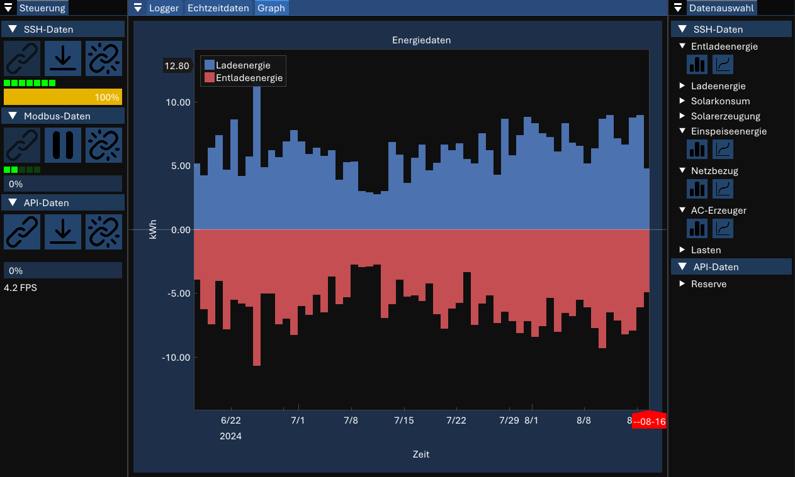

# Cerbo-Energy

Hierbei handelt es sich um ein Datenvisualisierungsprogramm, das Daten verschiedener Quellen abruft und darstellt.

## Aktueller Stand

Das Projekt ist ein Grundgerüst, welches noch ausgebaut wird und als "C++ - Übungsprojekt" dient
Ein Programm kann ohne Modifikationen nicht selbst gebaut werden, da wichtige Konfigurationen nur durch Änderung des Quellcodes gemacht werden können.

## Datenquellen

Daten werden von der [vrmapi](https://vrm-api-docs.victronenergy.com/#/), direkt vom GX-Gerät per Modbus TCP und per SSH-Verbindung zum GX-Gerät abgerufen. Die SSH-Verbindung erwartet eine CSV-Datei, die auf dem Gerät abgelegt ist.

## GUI

## Abhängigkeiten

Das GUI basiert auf [ImGui](https://github.com/ocornut/imgui), für die Netzwerkverbindungen sind libssh, modbus und libcurl, welche ebenfalls Abhängigkeiten haben.
